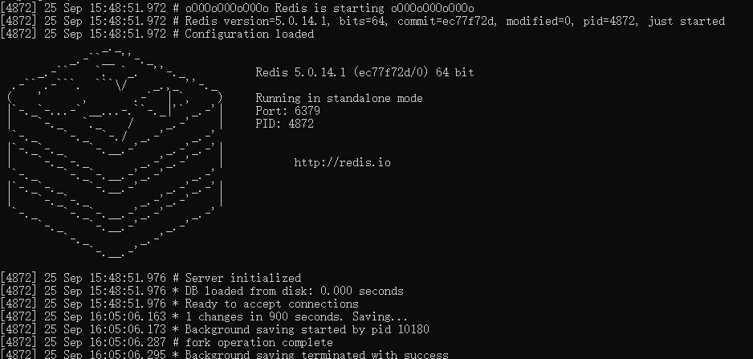
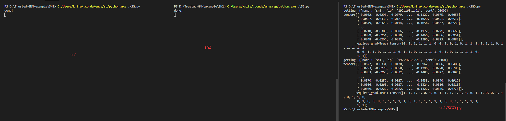

**SN1, SN2模拟两个机构，分别开启两个端口，模拟实验**
## 步骤
### 1.启动redis服务
*在redis有多种版本，样例使用的windows版本，不同系统下的操作和启动方式应该类似或相同。*

- 进入redis目录;
- 以命令的方式启动redis服务
   ```bash
   redis-server redis.windows.conf
   ```
- 启动成功后将根据默认配置开启6379端口，并有提示信息。
  
- *可通过 redis-cli -h 127.0.0.1 -p 6379   进入redis管理模式* 
### 2.启动SN-SEED服务
- 进入本目录，执行
  ```python SN-SEED.py```
 开启http服务

### 3.分别进入./SN1 和 ./SN2 执行
- 分别通过目录下的config.ini配置文件开启*20001,20002*端口
```python SG.py```

### 4.进入SN1，启动SGO，观察能否从SN2获取节点嵌入信息。




## 为了适应疫情预测任务，作出一些更新.（2022.11.20）

### 分别进入/SN1  /SN2 下启动 SG_local_embedy.py   开启任务

``` python
 ##使用示例
import zerorpc
import uuid
from security import *


## 本机端口
t = ('127.0.0.1',20001)

##初始化
task_id = str(uuid.uuid4())
print(task_id)
cstring = ('tcp://%s:%d'%(t[0],t[1]))
#自加密
pu = loadPublicKey('../public.pem')
text = pickle.dumps(task_id)
task_id = encrypt(text, pu)

c = zerorpc.Client()
c.connect(cstring)
c.iniItask(task_id)
c.close()
##交替训练
for i in range(1,20):
    it = 2*i
    #get_other_global_embed 
    cstring = ('tcp://%s:%d'%(t[0],t[1]))
    c = zerorpc.Client()
    c.connect(cstring)
    c.get_other_global_embed(task_id,it-1)
    c.close()
    #train_IntergratedModel
    cstring = ('tcp://%s:%d'%(t[0],t[1]))
    c = zerorpc.Client()
    c.connect(cstring)
    c.train_IntergratedModel(task_id, it)
    c.close()
c = zerorpc.Client()
c.connect(cstring)
##返回处理后的
x = c.back_local_embed(task_id)
decrypt(x)
```

```
##result
tensor([[-1.9669, -0.4994,  1.6806],
        [ 3.8275,  1.9439, -2.2863]], requires_grad=True)
```