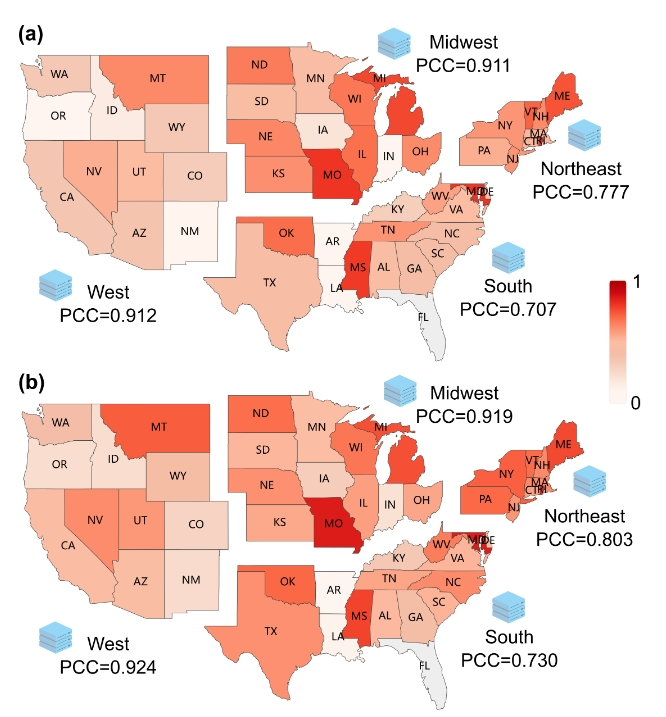
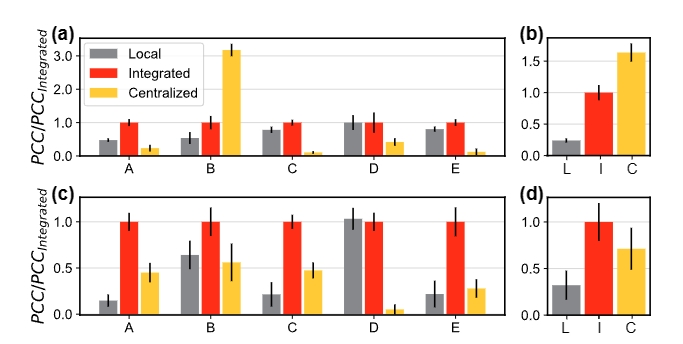

### CNL Project


This repository primarily consists of the experimental code for the CNL (Cooperative Network Learning) framework. CNL is a graph machine learning framework dedicated to the equitable and secure sharing of graph data. It encompasses several aspects, including network components, embedding computation, and embedding transmission.

## Introduction
CNL use P2P-network to construct. The agency which joins CNL repeatedly calls the get_nei_embed_sum service with a custom waiting time based on the task computation complexity. If a non-flag symbol −1 is obtained, the task continues to loop; otherwise, the task obtains the integrated embedding and stops looping. When the computation is completed, the HE computing node transfers the homomorphically encrypted ciphertext to agency and destroys its own message. The reliability of the passing process is guaranteed by remote procedure call (RPC) based on Transmission Control Protocol (TCP). 

## Ways to Use 
CNL can be run in two different modes: using a Docker image or deploying the environment directly from the repository.

### docker
1.  download img file from drive url.
2.  run:
```bash
docker load -i cnns.tar ##load img
# start the Docker image and configure port mapping and volume mounting to the host machine
docker run -itd --name test -p 20001:20001 -v /d/docker_tmp_file/SN1:/config -v /d/Trusted-GNN/example/data/:/data  cnns:1.0.1 

docker exec -it /bin/bash 
cd /home/CNNS
python3 SG.py
```

### configure local env
1. Clone the project repository from GitHub.
```bash
git clone git@github.com:CooperativeNetworkLearning/Cooperative-Network-Learning.git
    
```
2. Navigate to the project directory.
```bash
cd Cooperative-Network-Learning
```

3.  Create a virtual environment (optional but recommended).
```bash
conda create -n CNL python=3.8
```
4. Install the required dependencies using pip and the requirement.txt file.Please make sure you have the latest version of pip installed before proceeding with the installation.
```bash 
    pip install -r requirement.txt
```

## Experience

The experiments can be divided into two main parts: dynamic prediction and traditional graph tasks.

### Dynamic Prediction

- Experience on Generated Network:The first part involves experiments on generated network data, specifically on Erdős–Rényi graphs. Dynamic simulation data is generated using models such as Susceptible-Infected-Recovered (SIR) and Susceptible-Infected-Susceptible (SIS). These experiments are conducted using the generated code and data, which can be found in the "code" and "data" sections respectively.
  
- Experience on Contagion dynamics :The second part of the study utilizes datasets from US states, US regions, Spain, and Twitter. This research focuses on the fields of disease transmission dynamics and social network diffusion dynamics, specifically studying the propagation dynamics of real-world networks. The code and data for these experiments are the same as mentioned earlier.
### Traditional Graph Tasks
In order to explore the generalization capability of CNL, this section of experiments is conducted on traditional networks.
##### Node-Level Tasks
Experiments were conducted using the CNL framework on conventional network datasets such as Cora and PubMed. These experiments involved tasks such as node set partitioning to simulate different data structures and node classification prediction. The code and data for these experiments can be found in the ./node_level directory.

##### Edge-Level Tasks
On the Ciao recommendation system dataset, node set partitioning was performed to simulate different data structures. Using the CNL architecture with Graph Convolutional Networks (GCN), the goal was to predict user ratings for products. The code and data for these experiments can be found in the ./edge_level directory.

### Partial Results
**Result of influenza prediction in US states**

**Result of ontagion dynamics**
