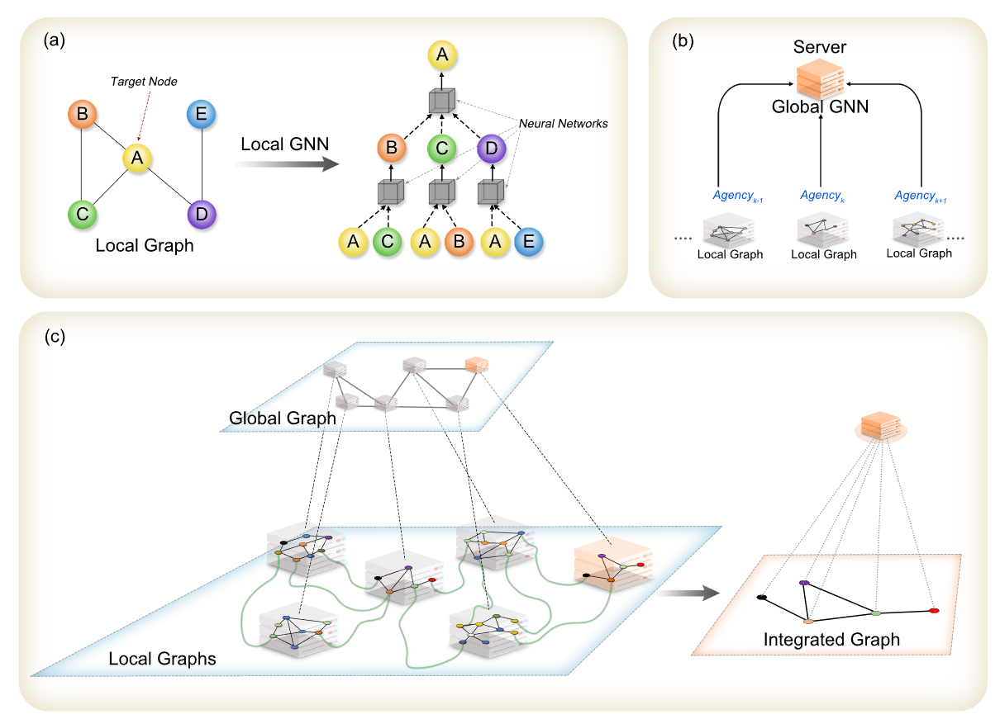

### CNL Project





##### Epidemiological Dynamics
- Study the spread of infectious diseases using epidemiological models in CNL way.

##### Node-Level Tasks
- *./node_level*
- Perform analysis and computations at the individual node level ON CNL.
- Implement algorithms and techniques for node-based data processing ON CNL.

##### Edge-Level Tasks
- *./edge_level*
- Focus CNL performance on link prediction.

##### Environment Setup
To set up the project environment, follow these steps:

1. Clone the project repository from GitHub.
2. Navigate to the project directory.
```bash
    git clone git@github.com:CooperativeNetworkLearning/Cooperative-Network-Learning.git
    cd your-project-repo
```
3. Create a virtual environment (optional but recommended).
4. Install the required dependencies using pip and the requirement.txt file.Please make sure you have the latest version of pip installed before proceeding with the installation.
```bash 
    pip install -r requirement.txt
```