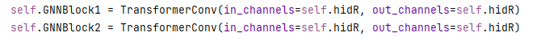
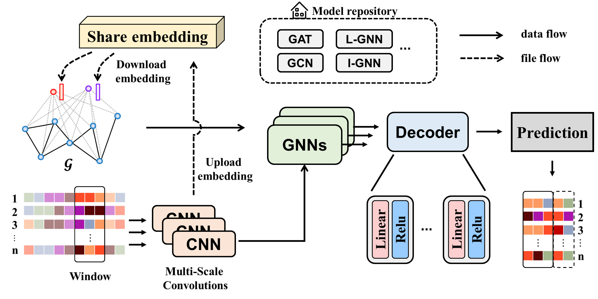
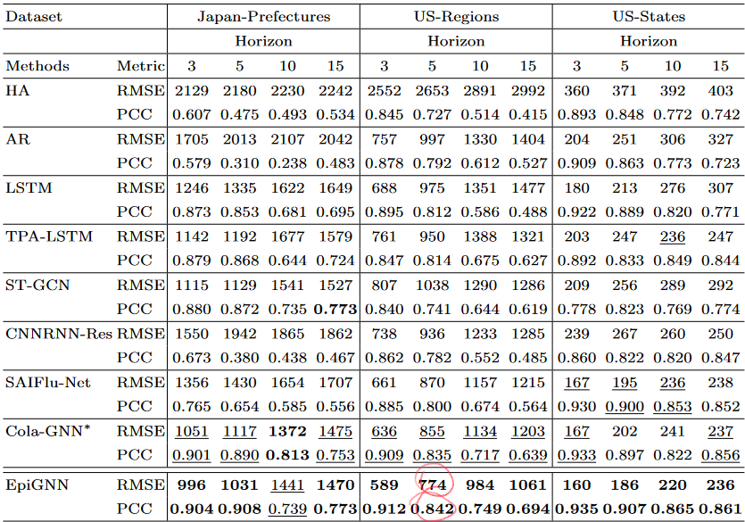
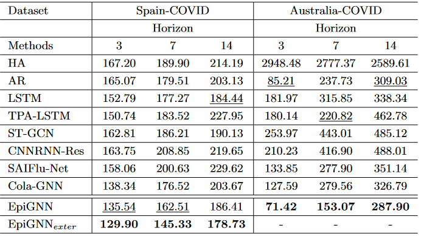

# 一、文件结构说明

## 1.1 data

每个数据集包含时序数据和网络数据两个文件

## 1.2 src

主要模型代码，具体说明见第二节

## 1.3 share_emb

嵌入共享区

## 1.4 utils

* file_utils.py 存储了嵌入文件和日志文件的命名规则

## 1.5 model

PandemicGNN.py文件中存储时空预测模型

通过修改如下代码快可以更换GNN模型

# 二、代码说明

多头卷积+GAT进行疫情预测

## 2.1 nei_cluster.ipynb

根据邻接矩阵获取划分

## 2.2 gen_local_emb.py 文件

该文件作用：(1) 生成local GNN和center GNN; (2) 生成机构的初始嵌入

institueion_idx = None时可以计算得到global GNN的结果

institueion_idx = 0时可以得到子机构0的结果, 依此类推

该文件会生成epoch-1的嵌入（初始嵌入，在share_emb目录下）和初始日志文件文件(.yaml文件，在locla_log目录下)

注意在不同的数据集上要设置不同的文件夹（修改args.trustGNNpath参数。如果两次运行用了同一个文件夹可能会导致文件读取出错）

## 2.3 integratedGNN.py

该文件作用：生成Integrated GNN

通过get_shareEmb函数获取共享的嵌入信息

args.runTag = 0 每次会读取runTag-1的邻居嵌入
（例如初始时runTag=0会读取gen_local_emb.py生成的epoch-1的嵌入；runTag=1时会读取integratedGNN生成的epoch0的嵌入）

## 2.4 solve_sub_metric.py

计算center GNN 的local view 指标

这里会直接加载 gen_local_emb.py 中训练得到的最优center GNN模型

注意，例如local GNN有0-3号节点，center GNN的local view计算这部分节点的RMSE(或其它指标)

## 2.5 solve_global_metric.ipynb

计算local GNN 和 integrated GNN 的global view 指标

该文件会读取指定runTag的 xx_log.yaml 日志文件

# 三、EpiGNN模型结果

